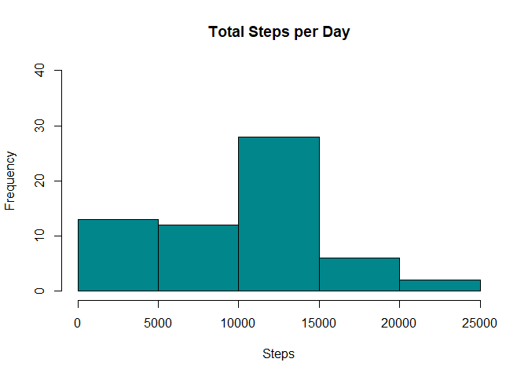
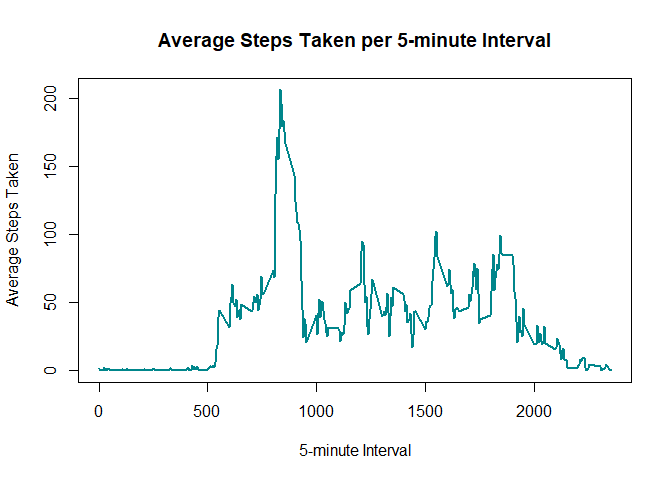
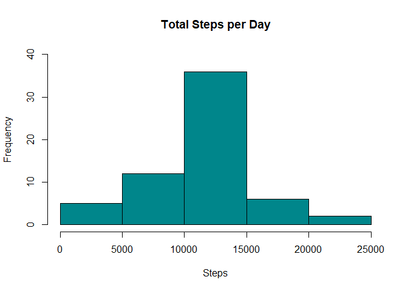
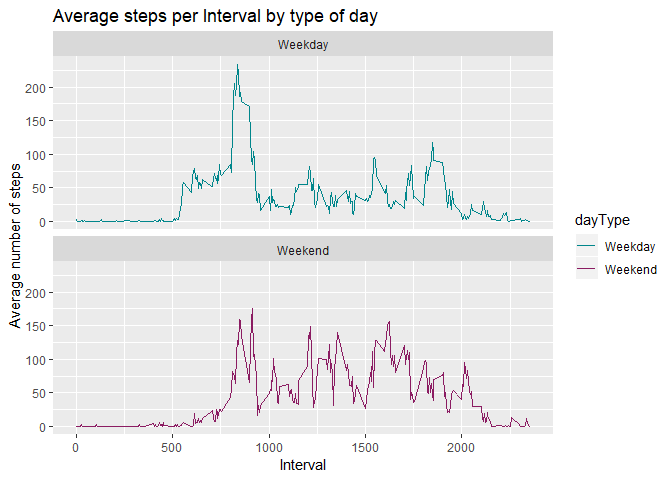

Daily Activity
================

Introduction
------------

It is now possible to collect a large amount of data about personal movement using activity monitoring devices such as a Fitbit, Nike Fuelband, or Jawbone Up. These type of devices are part of the "quantified self" movement - a group of enthusiasts who take measurements about themselves regularly to improve their health, to find patterns in their behavior, or because they are tech geeks. But these data remain under-utilized both because the raw data are hard to obtain and there is a lack of statistical methods and software for processing and interpreting the data.

This assignment makes use of data from a personal activity monitoring device. This device collects data at 5 minute intervals through out the day. The data consists of two months of data from an anonymous individual collected during the months of October and November, 2012 and include the number of steps taken in 5 minute intervals each day.

The data
--------

The dataset is stored in a comma-separated-value (CSV) file and there are a total of 17,568 observations in this dataset.

The variables included in this dataset are:

-   steps: Number of steps taking in a 5-minute interval (missing values are coded as NA)
-   date: The date on which the measurement was taken in YYYY-MM-DD format
-   interval: Identifier for the 5-minute interval in which measurement was take

Loading and preprocessing the data
----------------------------------

``` r
##Load packages
library(readr)
library(ggplot2)
library(dplyr)
```

    ## 
    ## Attaching package: 'dplyr'

    ## The following objects are masked from 'package:stats':
    ## 
    ##     filter, lag

    ## The following objects are masked from 'package:base':
    ## 
    ##     intersect, setdiff, setequal, union

``` r
##Get and unzip data
path<-getwd()
url<-"https://d396qusza40orc.cloudfront.net/repdata%2Fdata%2Factivity.zip"
download.file(url,file.path(path,"cp1.zip"))
unzip(zipfile="cp1.zip")

##Read in data
activityData<-read_csv("activity.csv")
```

    ## Parsed with column specification:
    ## cols(
    ##   steps = col_double(),
    ##   date = col_date(format = ""),
    ##   interval = col_double()
    ## )

``` r
##Condense data
byDate<-as.POSIXct(activityData$date, "%Y-%m-%d")
day <- weekdays(activityData$date)
activity<-cbind(activityData,day)

summary(activity)
```

    ##      steps             date               interval             day      
    ##  Min.   :  0.00   Min.   :2012-10-01   Min.   :   0.0   Friday   :2592  
    ##  1st Qu.:  0.00   1st Qu.:2012-10-16   1st Qu.: 588.8   Monday   :2592  
    ##  Median :  0.00   Median :2012-10-31   Median :1177.5   Saturday :2304  
    ##  Mean   : 37.38   Mean   :2012-10-31   Mean   :1177.5   Sunday   :2304  
    ##  3rd Qu.: 12.00   3rd Qu.:2012-11-15   3rd Qu.:1766.2   Thursday :2592  
    ##  Max.   :806.00   Max.   :2012-11-30   Max.   :2355.0   Tuesday  :2592  
    ##  NA's   :2304                                           Wednesday:2592

What is mean total number of steps taken per day?
-------------------------------------------------

First, we will want to calculate the total number of steps taken per day.

``` r
totalSteps_Day<-aggregate(activity$steps,
                          by=list(activity$date),
                          FUN=sum,
                          na.rm=TRUE)
names(totalSteps_Day)<-c("date","steps")
head(totalSteps_Day)
```

    ##         date steps
    ## 1 2012-10-01     0
    ## 2 2012-10-02   126
    ## 3 2012-10-03 11352
    ## 4 2012-10-04 12116
    ## 5 2012-10-05 13294
    ## 6 2012-10-06 15420

Now, let's look at a histogram of these results.

``` r
hist(totalSteps_Day$steps,
     main="Total Steps per Day",
     xlab="Steps",
     ylim=c(0,40),
     col="turquoise4")
```



We can now take a look at our measures of center for this data so far. This will be the measures of center with a simple removal of any NA values.

``` r
meanSteps<-round(mean(totalSteps_Day$steps,na.rm=TRUE),digits=2)
medSteps<-median(totalSteps_Day$steps,NA.RM=TRUE)
print(paste("The mean number of steps taken per day is",meanSteps,sep=" "))
```

    ## [1] "The mean number of steps taken per day is 9354.23"

``` r
print(paste("The median number of steps taken per day is",medSteps,sep=" "))
```

    ## [1] "The median number of steps taken per day is 10395"

What is the average daily activity pattern?
-------------------------------------------

Let's look at a time series plot for this dataset to determine any patterns.

``` r
##Make a time series plot of the intervals and the average steps taken per day
avgSteps_Int<-aggregate(activity$steps,
                        by=list(activity$interval),
                        FUN=mean,
                        na.rm=TRUE)
names(avgSteps_Int)<-c("interval","mean")

plot(avgSteps_Int$interval,avgSteps_Int$mean,
     type="l",
     col="turquoise4",
     lwd=2,
     xlab="5-minute Interval",
     ylab="Average Steps Taken",
     main="Average Steps Taken per 5-minute Interval")
```



We can also answer the question: Which 5-minute interval, on average across all the days in the dataset, contains the maximum number of steps?

``` r
maxAvg<-avgSteps_Int[which.max(avgSteps_Int$mean),]$interval
print(paste("The 5-minute interval with the maximum number of steps is",maxAvg,sep=" "))
```

    ## [1] "The 5-minute interval with the maximum number of steps is 835"

Imputing missing values
-----------------------

Let's start by finding out how many total missing values (NAs) there are currently in the dataset.

``` r
totalNA<-sum(is.na(activity$steps))
print(paste("The total number of NAs in the dataset is",totalNA,sep=" "))
```

    ## [1] "The total number of NAs in the dataset is 2304"

Let's remove all of the current NA values and replace them with the mean of that interval.

``` r
##Create a new dataset that is equal to the original dataset but with the missing data filled in
activityImputed<-activity
activityNA<-is.na(activityImputed$steps)
intervalAvg<-tapply(activity$steps, activity$interval, mean, na.rm=TRUE, simplify=T)
activityImputed$steps[activityNA] <- intervalAvg[as.character(activityImputed$interval[activityNA])]
summary(activityImputed)
```

    ##      steps             date               interval             day      
    ##  Min.   :  0.00   Min.   :2012-10-01   Min.   :   0.0   Friday   :2592  
    ##  1st Qu.:  0.00   1st Qu.:2012-10-16   1st Qu.: 588.8   Monday   :2592  
    ##  Median :  0.00   Median :2012-10-31   Median :1177.5   Saturday :2304  
    ##  Mean   : 37.38   Mean   :2012-10-31   Mean   :1177.5   Sunday   :2304  
    ##  3rd Qu.: 27.00   3rd Qu.:2012-11-15   3rd Qu.:1766.2   Thursday :2592  
    ##  Max.   :806.00   Max.   :2012-11-30   Max.   :2355.0   Tuesday  :2592  
    ##                                                         Wednesday:2592

Now that we have removed all of the NA values and replaced them with the mean of that interval, let's take a look at the same histogram as above with our new data. We will also find the new mean and median given our new dataset.

``` r
##Make a histogram of the total number of steps taken each day
totalSteps_Day_Im<-aggregate(activityImputed$steps,
                             by=list(activityImputed$date),
                             FUN=sum,
                             na.rm=TRUE)
names(totalSteps_Day_Im)<-c("date","steps")

hist(totalSteps_Day_Im$steps,
     main="Total Steps per Day",
     xlab="Steps",
     ylim=c(0,40),
     col="turquoise4")
```



``` r
##Calculate and report the mean and median total number of steps taken per day. 
meanStepsIm<-round(mean(totalSteps_Day_Im$steps,na.rm=TRUE),digits=2)
medStepsIm<-round(median(totalSteps_Day_Im$steps,NA.RM=TRUE),digits=2)
print(paste("For the imputed dataset,the mean number of steps taken per day is",meanStepsIm,sep=" "))
```

    ## [1] "For the imputed dataset,the mean number of steps taken per day is 10766.19"

``` r
print(paste("For the imputed dataset,the median number of steps taken per day is",medStepsIm,sep=" "))
```

    ## [1] "For the imputed dataset,the median number of steps taken per day is 10766.19"

We can see that the histogram, while still showing the same trends and distribution as above, has a higher frequency count, which is especially noticeable in the interval from 10,000 to 15,000 steps (where our measures of center lie). Also, notice how both histograms were created with the same y-limit so we can compare the two plots more reasonably. Normally, the first histogram would have a smalled y-limit, but that would allow for a less impactful visual difference between the two.

Aside from the histograms showing a difference between original and imputed data are the measures of center. We went from a mean of 9354.23 and a median of 10395 to a new mean and median of the same value, 10766.19.

We can clearly see that the NA values were skewing our original data and creating a significant difference between the mean and the median. After imputing the data, we can see that our mean and median are now exactly the same, which give us a nice, symmetrical spread.

Are there differences in activity patterns between weekdays and weekends?
-------------------------------------------------------------------------

To compare the differences between weekday and weekday data, we first need to separate the imputed dataset by day type.

``` r
dayType<-sapply(activity$day,function(x)
        {if(x=="Saturday"|x=="Sunday")
                {y<-"Weekend"} else
                {y<-"Weekday"}
                y
        })
```

From here, we can create two time series plots to show the differences between our Monday-Friday and Saturday-Sunday data.

``` r
avgPerInt_dayType<-aggregate(steps~interval + dayType, activity, mean, na.rm = TRUE)
ggplot(avgPerInt_dayType,aes(x = interval , y = steps, color = dayType)) +
        geom_line() +
        scale_color_manual(values = c("turquoise4", "maroon4")) +
        labs(title = "Average steps per Interval by type of day", x = "Interval", y = "Average number of steps") +
        facet_wrap(~dayType, ncol = 1, nrow=2)
```



While we can see that there is still a maximum number of steps between interval 500 and 1000, there are clearly more steps taken on average during intervals 1000 to 2000 on the weekend vs. during the week.
